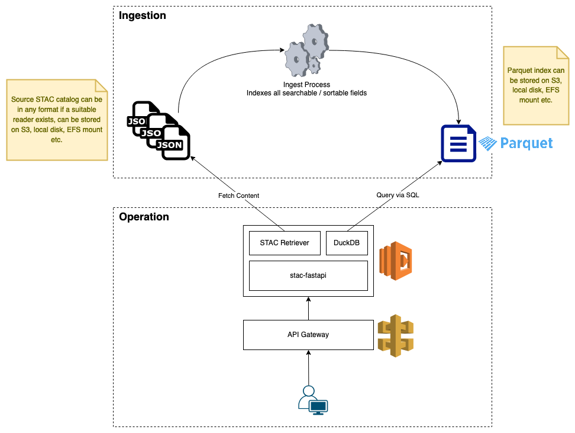

# STAC API Serverless

[](https://github.com/sparkgeo/STAC-API-Serverless/actions/workflows/pull-request-all.yml)

A [stac-fastapi](https://github.com/stac-utils/stac-fastapi) backend that indexes a STAC catalog to Parquet to make it searchable. The ability to work with static files, and the lack of a need for another persistent data store such as a database, mean this backend can run in a serverless environment. See [Overview](#overview) for more information on this approach.

Is this project suitable for your use-case? See [Suitability](./docs/suitability.md) for a review of advantages, disadvantages, and limitations.

## Known Issues

See [Known Issues](./docs/known-issues.md) for more information.

## Development

See [Development](./docs/development.md) for detailed guidance on how to work on this project.

### Quickstart

To get a quick demo up and running with a test dataset execute any of the following scripts and navigate to http://localhost:8123/api.html

```sh
# loads a sample dataset into minio, indexes it, loads the index into minio, and runs the API
scripts/run-with-local-s3.sh
# indexes a sample dataset on the filesystem and runs the API
scripts/run-with-local-file.sh
# loads a sample dataset into a HTTP fileserver, indexes it, and runs the API
scripts/run-with-local-http.sh
```

### Index Remote STAC Catalog

This project includes a convenience script to index and serve a remote STAC catalog. This script will fully index the remote STAC catalog each time it is run. This may not be the most efficient way to meet your needs, but it does help demonstrate some of this project's capabilities.

```sh
# indexes a public static STAC catalog over HTTPS and runs the API
scripts/run-with-remote-source.sh https://esa.pages.eox.at/cubes-and-clouds-catalog/MOOC_Cubes_and_clouds/catalog.json
```

Output includes the following information about the index.
```sh
* Indexing may take some time, depending on the size of the catalog
* Indexing to /.../source/sparkgeo/STAC-API-Serverless/.remote-source-index/httpsesapageseoxatcubesandcloudscatalogMOOCCubesandcloudscatalogjson
```

The generated index files can be inspected at `.../.remote-source-index/httpsesapageseoxatcubesandcloudscatalogMOOCCubesandcloudscatalogjson` if necessary. If at a later time you want to run the API against this same index, without re-indexing the remote STAC catalog, this can be achieved with the following:

```sh
docker run \
    --rm \
    -it \
    -v $PWD/.remote-source-index/httpsesapageseoxatcubesandcloudscatalogMOOCCubesandcloudscatalogjson:/index:ro \
    -e stac_api_indexed_index_manifest_uri=/index/manifest.json \
    -p 8123:80 \
    sparkgeo/stac_fastapi_indexed
```

## Overview

This repository supports two related but distinct behaviours. The `stac-index.*` packages defined in [stac_index/](./packages/stac-index/) manage indexing of a STAC catalog. The `stac-fastapi.indexed` package defined in [stac_fastapi/](./src/stac_fastapi/) implements a stac-fastapi backend that works with the index created by `stac-index.*` packages.

The indexer might only be run once on a stable dataset, or may be run repeatedly for a changing dataset. The stac-fastapi backend will consult the index for every request the API receives.

There is no requirement for the API to run in a serverless environment - in some cases the associated performance concerns may be unacceptable - though its ability to run in a serverless environment is a key factor in its design.



### Readers

Source and Index Readers support extensibility in the design and determine where and how this design can be used.

STAC objects (catalog, collections, items) are identified by a unique URI. Each URI's format determines which reader must be used to read its content.
- The [S3 Reader](./packages/stac-index/src/stac_index/io/readers/s3/) is used to read any content identified by a URI with a `s3://` prefix.
- The [Filesystem Reader](./packages/stac-index/src/stac_index/io/readers/filesystem/) is used to read any content identified by a URI with a `/` prefix.
- The [HTTPS Reader](./packages/stac-index/src/stac_index/io/readers/https/) is used to read any content identified by a URI with a `http(s)://` prefix.

An error will be thrown if an unsupported URI prefix is encountered.

### Indexer

The indexer is configured with a root catalog URI. From the root catalog the indexer traverses the catalog's sub-catalogs (if present), collections and items, relying on STAC's `links` objects to provide their URIs.

The indexer selects a suitable reader for each URI as described in [Readers](#readers). In this way the indexer can index a local STAC catalog, a remote S3-hosted STAC catalog (assuming any auth concerns are addressed), a HTTP(S)-hosted STAC catalog, and potentially any number of other STAC storage methods.

The indexer creates an index entry for every STAC collection and item in the catalog. By default each item's index entry includes the item's ID and collection, which together form its unique identifier, and values of the minimum set of properties required to support the API's base requirements. This minimum set of properties includes datetimes, BBOX, and the URI of the item's full content.

If the root catalog contains sub-catalogs these are recursively read to ensure all collections are discovered. Information about which sub-catalog(s) provided which collection(s) is not recorded by the indexer and all collections are referenced as direct children of the root catalog.

Only necessary properties from the STAC catalog are indexed, rather than copying the entire catalog to Parquet, to maximise query performance and minimise data duplication.

The indexer can be configured with any number of queryable and / or sortable fields. Any fields identified as queryable or sortable will also be indexed by the indexer. See [Index Configuration](./docs/index-config.md) for more information on indexer configuration.

The indexer produces a number of Parquet files, which must be made accessible in some way to the API.


### API

The API is configured with an index manifest URI which identifies the location of Parquet index files. During API operation Parquet files are read by DuckDB and therefore can only be accessed via a method supported by DuckDB. While there is flexibility in how STAC content can be accessed by both the indexer and the API, Parquet index files should only be accessed via either the S3 or Filesystem readers. The API accesses Parquet index files in read-only mode and cannot modify them.

For each reqeust the API constructs an SQL query to run against the STAC catalog's index. DuckDB is responsible for satisfying SQL queries and manages interaction with Parquet data. The SQL query returns zero or more URIs referencing collections or items that satisfy the request. The API retrieves the full STAC content from those URIs, using the appropriate reader, and returns a response.


#### Pagination

As defined by the [STAC API specification](https://github.com/radiantearth/stac-api-spec/tree/v1.0.0/item-search#pagination), STAC items returned by the `/search` and `/collections/{collection_id}/items` endpoints support page limits and pagination behaviour. The specification does not currently describe appropriate paging behaviour around data changes.

Consider the following scenario:
- An API client issues a search request and receives the first page of a multi-page response, which is sorted according to the request's `sortby` property (if supported) or a default sort field, with a link to the next page.
- A STAC data update occurs which:
  - removes one or more STAC items included in the first page of results,
  - adds one or more STAC items that would have been matched by the search request, and / or
  - alters one or more STAC items such that they would or would not have been matched by the search request.
- The API client requests the second page of search results using the "next" link from the first page.

In this scenario the API client receives the wrong data. Possible outcomes include (this list is not exhaustive):
- One or more items from the first page may be repeated.
- One or more items that would - with the updated data - have been included in the first page were not provided to the client.
- There are 0 items as the result is now <= 1 page.
- There is an internal error as the result is now <= 1 page and the API implementation does not handle this scenario gracefully.

This project prohibits pagination across data changes. If the API determines that a data update has occurred between page requests a `409 Conflict` will be returned with a message instructing the caller to reissue their request.
